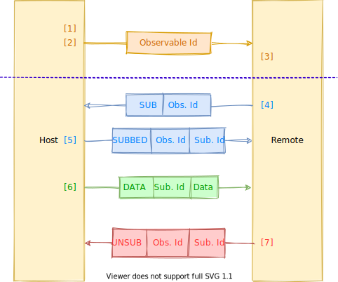

# observables-over-boundary
Allow observables to be communicated over a boundary (such as network)

# Protocol

Internal Process          | Communication Protocol
------------------------- | -----------------------------------
 | 
